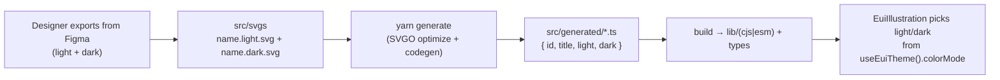

# @elastic/eui-illustrations

Theme-adaptable SVG illustrations for Elastic UI.

This package is framework-agnostic and ships raw, designer-authored SVGs as typed modules. Assets are reusable by `@elastic/eui` (through `EuiIllustration`), Kibana, Cloud UI and any other consumer. Each illustration carries a `light` and a `dark` variant, and the consumer renders the one that matches the active
color mode.

## How it works

Designers never touch TypeScript. They export an illustration from Figma for both color modes and drop two files into `src/svgs`:

- `dashboard.light.svg`
- `dashboard.dark.svg`

`yarn generate` then optimizes each SVG (SVGO) and writes a typed module per illustration into `src/generated` (git-ignored, always regenerated). The illustration name is the base file name.



Each generated module satisfies:

```ts
type EuiIllustrationSource = {
  id: string; // 'dashboard'
  title: string; // 'Dashboard'
  light: string; // optimized SVG markup
  dark: string; // optimized SVG markup
};
```

## Consuming

### With `@elastic/eui`

`EuiIllustration` reads the active color mode from `useEuiTheme()` and inlines the correct SVG, no wiring required:

```tsx
import { EuiIllustration } from '@elastic/eui';
import { dashboard } from '@elastic/eui-illustrations';

<EuiIllustration type={dashboard} alt="Dashboards" />;
```

### Without `@elastic/eui`

The modules are plain data. Pick a mode and inline the markup yourself:

```tsx
import { dashboard } from '@elastic/eui-illustrations';

const svg = isDarkMode ? dashboard.dark : dashboard.light;
<span dangerouslySetInnerHTML={{ __html: svg }} />;
```

You can also enumerate everything inside the `illustrations` record:

```ts
import { illustrations } from '@elastic/eui-illustrations';
Object.values(illustrations).map((i) => i.id);
```

## Adding an illustration

1. Export the illustration from Figma for light and dark.
2. Drop `<name>.light.svg` and `<name>.dark.svg` into `src/svgs`.
3. Run `yarn generate` (build/lint/test run it automatically).

That's it - the typed export and the `illustrations` record update themselves!

## Running locally

```bash
# from packages/illustrations
yarn generate   # regenerate src/generated from src/svgs
yarn build      # generate + compile CJS/ESM + type declarations
yarn lint       # generate + tsc --noEmit
yarn test       # lint + unit tests
```

## Testing in EUI Storybook

`EuiIllustration` has a story (`Display/EuiIllustration`) that renders the `dashboard` asset from this package. To see it:

```bash
# 1) build this package so @elastic/eui can resolve it
yarn workspace @elastic/eui-illustrations build

# 2) run EUI Storybook and toggle the light/dark theme in the toolbar
yarn workspace @elastic/eui start
```

## Release

This package is versioned and published to npm independently from `@elastic/eui`. Add an upcoming changelog entry (`changelogs/upcoming/<PR>.md`) with your change, then scope the release commands to **only** this workspace:

```bash
# 1) Prepare the release (bumps the version, collates the changelog and opens the release PR)
yarn release:prep --workspaces @elastic/eui-illustrations

# 2) After the release PR is merged, publish to npm. Publish auto-detects the workspaces changed in the release PR.
yarn release:publish
```

## Testing local changes in Kibana

`yarn link` does **not** work between EUI and Kibana because Kibana is on Yarn v1 while this repo is on Yarn v4.

Instead, build a tarball and point Kibana at it with the `file:` protocol (same flow as `@elastic/eui`, see the EUI wiki: [_Testing EUI features in Kibana_](../../wiki/contributing-to-eui/testing/testing-in-kibana.md)).

```bash
# 1) in EUI: build + pack this package into a .tgz
yarn workspace @elastic/eui-illustrations build-pack # -> elastic-eui-illustrations-1.0.0.tgz

# 2) copy the tarball to the Kibana repo root
cp packages/illustrations/elastic-eui-illustrations-1.0.0.tgz /path/to/kibana/
```

Then in Kibana's root `package.json`:

```jsonc
"@elastic/eui-illustrations": "file:./elastic-eui-illustrations-1.0.0.tgz"
```

```bash
# 3) in Kibana: bootstrap (`‑‑no-validate` is required for a .tgz) and start
yarn kbn bootstrap --no-validate && yarn start
```

After each change, re-run `yarn build-pack` and **rename** the `.tgz` (e.g. `…-1.0.0-1.tgz`, `…-1.0.0-2.tgz`) so Yarn picks up the new contents, then update the `file:` path and re-bootstrap.

FUTURE NOTE: there exists "Watch mode" for EUI for live-editing but it doesn't include this new package _yet_.
