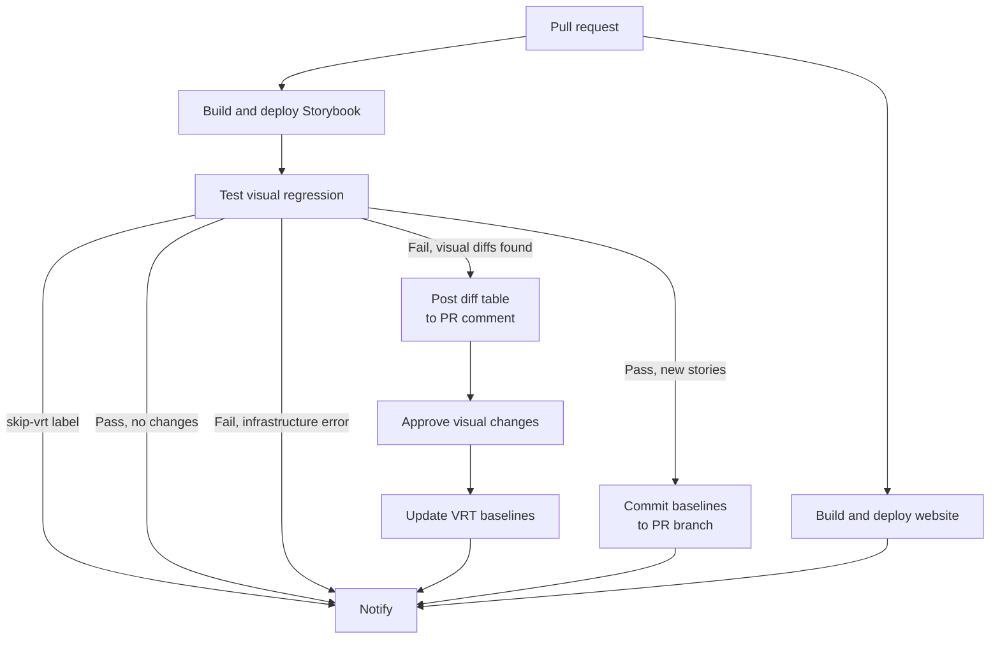

# Visual regression testing

EUI uses [Playwright Test Runner](https://playwright.dev/) with [`jest-image-snapshot`](https://github.com/americanexpress/jest-image-snapshot) for component visual regression testing. Tests run against a live Storybook instance and compare screenshots of stories against previously approved reference images.

Visual regression tests run automatically on every pull request against the deployed Storybook preview. When differences are found, a diff table is posted as a PR comment and a Buildkite block step appears for human approval before baselines are updated.

## Running VRT locally

Make sure you have [Docker](https://docs.docker.com/get-docker/) installed and running. It's used to take screenshots in a Linux environment matching CI.

Run the visual regression tests:

```shell
yarn workspace @elastic/eui test-visual-regression
```

Locally this builds and serves a static Storybook (like CI) and rebuilds it each run, so no dev server is needed and every run reflects your current stories. To test against a specific URL instead (e.g. a deployed PR preview):

```shell
yarn workspace @elastic/eui test-visual-regression -- --url https://eui.elastic.co/pr_1234/storybook
```

### Static build vs. dev server

The static build is served from flat files (no HMR) which keeps `networkidle` settling instantly. The dev server's HMR can otherwise stall it under emulation and make stories time out (see [Troubleshooting](#every-story-fails-with-pagewaitforloadstate-timeout-30000ms-exceeded)). The build happens inside the container (Linux, matching CI) and is reused across variants.

```shell
# Reuse the existing build for fast iteration (skip the rebuild)
yarn workspace @elastic/eui test-visual-regression -- --no-build

# Use the dev server instead (requires `yarn storybook --no-open` running)
yarn workspace @elastic/eui test-visual-regression -- --no-static
```

`--static`/`--build` default on locally and are ignored when `--url` is set.

## Updating baseline screenshots

```shell
# Update all baselines
yarn workspace @elastic/eui test-visual-regression update

# Update baselines against a specific URL
yarn workspace @elastic/eui test-visual-regression update -- --url https://eui.elastic.co/pr_1234/storybook
```

Reference images are stored in `packages/eui/.vrt/reference/`.

## Variants

Each story is snapshotted under multiple **variants** to catch e.g. responsive-layout regressions. Every variant produces its own baseline file, suffixed with the variant name:

    packages/eui/.vrt/reference/
      navigation-euibutton--playground-desktop.png
      navigation-euibutton--playground-mobile.png

The test-runner is invoked once per variant (similar to [Playwright projects](https://playwright.dev/docs/test-projects)), so each variant runs in its own process and browser context with the viewport applied before the story renders. Variants are defined in the `VARIANTS` map in [`.storybook/vrt.ts`](https://github.com/elastic/eui/tree/main/packages/eui/.storybook/vrt.ts); [`scripts/test-visual-regression.js`](https://github.com/elastic/eui/tree/main/packages/eui/scripts/test-visual-regression.js) selects the active one per run using the `VRT_VARIANT` environment variable.

Current variants:

| Variant | Viewport |
|---|---|
| `desktop` | 1440 × 900 |
| `mobile` | 390 × 844 |

### Skipping specific variants

If a story can't render correctly under a particular variant, opt out of just that variant by passing an array to `parameters.vrt.skip` (see [Skipping stories](#skipping-stories)). The story still runs under the remaining variants.

## Filtering stories

Pass any [`test-storybook`](https://storybook.js.org/docs/writing-tests/test-runner) flags after `--`. Jest path filters need `--` before the pattern:

```shell
# By story name
yarn workspace @elastic/eui test-visual-regression -- -- euibutton
# By story file
yarn workspace @elastic/eui test-visual-regression -- -- --testPathPattern=button.stories

# By tag
yarn workspace @elastic/eui test-visual-regression -- --includeTags vrt-only
yarn workspace @elastic/eui test-visual-regression -- --excludeTags skip-vrt
```

The wrapper runs both variants. For one variant only:

```shell
VRT_VARIANT=desktop yarn workspace @elastic/eui test-storybook -- euibutton
```

## Skipping stories

Set `parameters.vrt.skip` to opt a story out of VRT. Leave a comment explaining why.

- `skip: true` skips the story under **all** variants.
- `skip: ['mobile']` skips only the listed variants; the story still runs under the rest.

```tsx
export const MyStory: Story = {
  parameters: {
    vrt: {
      // Skipped: this story is interaction-only, not a visual state
      skip: true,
    },
  },
};

export const MobileUnsupported: Story = {
  parameters: {
    vrt: {
      // Skipped on mobile: the toolbar control is hidden below this breakpoint
      skip: ['mobile'],
    },
  },
};
```

Skipping a variant also skips the story's `play` body for that variant, so e.g. interactions don't run at a viewport the story isn't built for.

When you add `vrt.skip` to a story that previously had a baseline, manually delete the affected snapshot files from `packages/eui/.vrt/reference/` (all variants for `true` or just the listed ones for an array).

## Using non-default selectors

By default the test runner screenshots `#story-wrapper > *`. For components that render outside the story wrapper (portals, popovers, dropdowns) specify a custom selector in `parameters.vrt.selector`.

Predefined selectors are exported from [`.storybook/vrt.ts`](https://github.com/elastic/eui/tree/main/packages/eui/.storybook/vrt.ts):

```tsx
import { VRT_SELECTORS } from '../../../.storybook/vrt';

export const Open: Story = {
  parameters: {
    vrt: {
      selector: VRT_SELECTORS.portal,
    },
  },
};
```

Available selectors:

| Selector | Value | Use case |
|---|---|---|
| `VRT_SELECTORS.default` | `#story-wrapper > *` | Default (no need to set) |
| `VRT_SELECTORS.textOnly` | `#story-wrapper` | Components rendering a text node |
| `VRT_SELECTORS.portal` | `page` | Portalled elements (popover, tooltip, dropdown); takes a full-page screenshot |

## Using interactions for specific states

Wrap play functions with `playDecorator` when they need to reach elements outside the story wrapper (e.g. portals). It injects `bodyElement` (`document.body`) into the context so `within(bodyElement)` can query portal content.

```tsx
import { userEvent, waitFor, within, expect } from '@storybook/test';
import { VRT_SELECTORS, playDecorator } from '../../../.storybook/vrt';

export const OpenDropdown: Story = {
  parameters: {
    vrt: { selector: VRT_SELECTORS.portal },
  },
  play: playDecorator(async (context) => {
    const { canvasElement, bodyElement } = context;

    // canvasElement: content inside the story wrapper
    const canvas = within(canvasElement);
    // bodyElement: use this to reach portalled elements
    const body = within(bodyElement);

    await userEvent.click(canvas.getByRole('combobox'));
    await waitFor(() => {
      expect(body.getByRole('listbox')).toBeVisible();
    });
  }),
};
```

By default the play function is skipped when not running under Playwright (i.e. in the Storybook UI). Pass `false` as the second argument to run it everywhere:

```tsx
play: playDecorator(async (context) => { ... }, false)
```

## Authoring stable stories

VRT compares screenshots pixel-for-pixel, so anything non-deterministic (network requests, animations, randomness, timing or capturing the wrong element) produces false diffs or flaky failures. The test-runner already neutralizes several sources globally:

- CSS animations are paused before the screenshot (`animations: 'disabled'`) and `prefers-reduced-motion: reduce` is emulated.
- The runner waits for the page to be ready and for all `` elements to finish decoding before capturing.
- Failed screenshots are retried automatically.

Some common failures and how to fix them:

### Only the first element is captured (fragment roots)

The default selector `#story-wrapper > *` screenshots the **first child element** of the wrapper. A `render` function or decorator that returns a fragment with multiple siblings therefore captures only the first one and clips the rest:

```tsx
// ❌ Only the first <EuiBanner> is captured
render: () => (
  <>
    <EuiBanner />
    <EuiBanner />
  </>
),

// ✅ Wrap in a single element so the whole set is captured
render: () => (
  <div>
    <EuiBanner />
    <EuiBanner />
  </div>
),
```

This also applies to decorators that add sibling content (e.g. wrapping the story in explanatory text) - wrap them in an element, not a fragment.

### Portalled content isn't captured

Popovers, tooltips, modals, flyouts and dropdowns render outside the story wrapper, so the default selector misses them. Use the portal selector to take a full-page screenshot (see [Using non-default selectors](#using-non-default-selectors)):

```tsx
parameters: { vrt: { selector: VRT_SELECTORS.portal } },
```

### Overlays captured before they finish opening

An overlay opened on mount (through `isOpen` or initial state) may not be rendered/positioned when the screenshot fires, producing a blank or half-positioned capture that flakes. Add a `play` that waits for it to be visible:

```tsx
import { within } from '../../../.storybook/test';
import { playDecorator } from '../../../.storybook/vrt';

export const Open: Story = {
  parameters: { vrt: { selector: VRT_SELECTORS.portal } },
  play: playDecorator(async ({ canvasElement }) => {
    await within(canvasElement).waitForEuiPopoverVisible();
  }),
};
```

For portalled panels you can also assert against `bodyElement`:

```tsx
play: playDecorator(async ({ bodyElement }) => {
  await waitFor(() =>
    expect(bodyElement.querySelector('[data-popover-open]')).toBeVisible()
  );
}),
```

### Remote assets (images, avatars, fonts)

Never reference remote URLs (`placehold.co`, `images.unsplash.com`, `picsum.photos`, `gravatar` etc.). Network fetches are slow and unreliable in CI, causing instability. Inline the asset as a `data:` URI instead:

```tsx
const svg = `<svg xmlns="http://www.w3.org/2000/svg" width="64" height="64"><rect width="100%" height="100%" fill="#0B64DD"/></svg>`;

<EuiAvatar imageUrl={`data:image/svg+xml,${encodeURIComponent(svg)}`} />
```

If a story genuinely needs a real raster image (e.g. the `EuiImage` showcase), either bundle a committed local asset or `vrt.skip` the story.

### Randomized or time-based data

`faker` without a seed, `Math.random()`, `Date.now()` and `new Date()` render different output on every run. Pin them:

```tsx
import { faker } from '@faker-js/faker';

faker.seed(123); // consistent data across runs
```

Use fixed dates/values for anything rendered (e.g. `date="January 1st 1970"`).

### Oversized stories

Stories that render hundreds of rows/items produce very tall screenshots that are slow to capture and can time out (especially under the `mobile` variant where responsive layouts stack every cell vertically). Keep datasets small. Note that `EuiBasicTable`/`EuiInMemoryTable` don't paginate `items` themselves, so passing a large array renders every row.

### Interaction- or behavior-only stories

If a story exists to demonstrate behavior (focus return, callbacks, keyboard handling) and is visually identical to another captured story, it adds no VRT value and only risks flake - [skip it](#skipping-stories) with `vrt.skip` and a comment.

### Text-only components

A bare text node can have zero height under `#story-wrapper > *`. Use `VRT_SELECTORS.textOnly` so the wrapper itself is captured (see [Using non-default selectors](#using-non-default-selectors)).

## Troubleshooting

### Every story fails with `page.waitForLoadState: Timeout 30000ms exceeded`

`waitForPageReady` waits for `networkidle` on Playwright's own 30s timeout (separate from Jest's `--testTimeout`). The **dev server's** HMR keep the network busy. Under emulation it never goes idle in time, so *every* story times out and suites take 10-20 minutes.

**Fix:** don't pass `--no-static` locally. The default [static build](#static-build-vs-dev-server) has no HMR, so `networkidle` settles instantly.

### VRT is slow or times out locally on Apple Silicon

Local runs use a `linux/amd64` container to match CI. On Apple Silicon (arm64) that image is **emulated** and much slower than native, making large stories hang or time out:

- **Enable Rosetta (recommended).** In Docker Desktop, turn on _Settings → General → "Use Rosetta for x86_64/amd64 emulation on Apple Silicon"_, and raise CPU/memory under _Settings → Resources_. Far faster than the default QEMU emulation while still `linux/amd64`, so screenshots stay byte-identical to CI.
- **Run natively for quick checks only.** Dropping `--platform linux/amd64` runs the native arm64 image (no emulation, much faster). Renders are usually identical but architecture can introduce 1-2px anti-aliasing differences, so **don't commit baselines this way** - use it only to check stories run and let CI produce baselines.

The Docker path in [`scripts/test-visual-regression.js`](https://github.com/elastic/eui/tree/main/packages/eui/scripts/test-visual-regression.js) also caps `--maxWorkers` and raises `--testTimeout` for headroom.

## CI pipeline architecture

VRT runs automatically on every pull request as part of the `eui-deploy-docs` Buildkite pipeline.



CI commits baselines directly to the PR branch:

- `chore(eui): add VRT baseline screenshots` - the PR adds new stories. Automatic, regardless of pass/fail.
- `chore(eui): update VRT baseline screenshots` - after approving the *Approve visual changes* block step in Buildkite.

A PR with both new and changed stories gets both commits, `add` first. Either commit retriggers CI.

### Skipping in a PR

If VRT itself is broken and blocking merges, add the `skip-vrt` label to the GitHub PR. The VRT step will detect the label, exit without running any tests and the notify comment will clearly state that VRT was skipped.

> [!WARNING]
> `skip-vrt` doesn't run the test runner, so new stories don't get baselines. Be especially careful if you're adding it on your PR that introduces visual changes.

The label is captured at build-trigger time. To affect an existing build, trigger a fresh one:

- Comment `buildkite test it` on the PR
- Push any new commit
- Close and reopen the PR
- Buildkite UI: click **New Build** (not "Rebuild", which reuses the original env)
